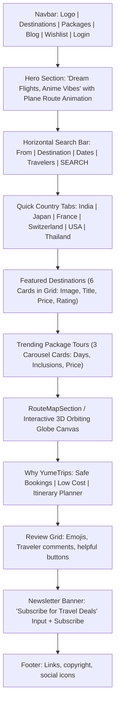
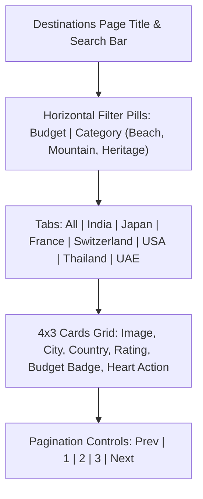
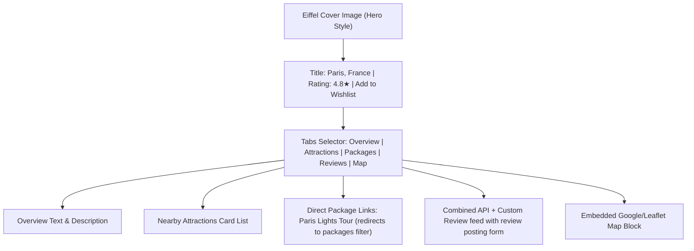
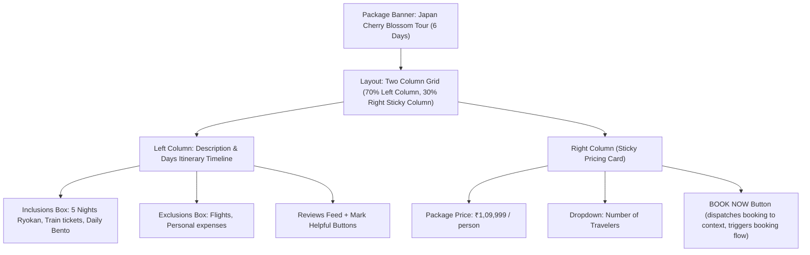
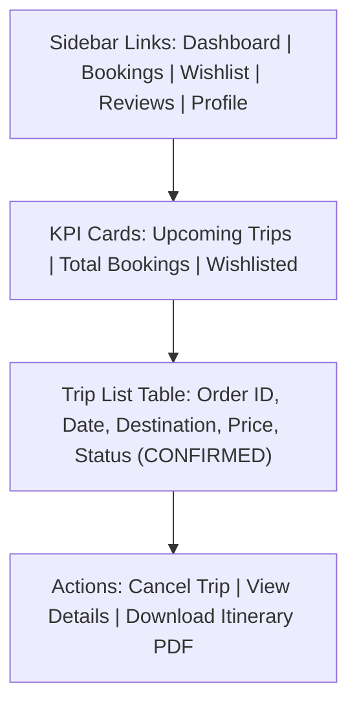

# YumeTrips UI Wireframes & Layout Design Guide

This guide details the complete UI wireframe blueprints and visual design tokens for the **YumeTrips** travel booking platform. It aligns the MERN/Spring Boot Mapped backend features with a clean, high-fidelity React frontend.

---

## 1. Visual Style & Design System (Theme Spec)

YumeTrips is designed around a premium **Dark Anime Travel** aesthetic. Use the following tokens for CSS/Tailwind styling:

| Token Name | Token Type | Value / Hex | Usage |
| :--- | :--- | :--- | :--- |
| **Dark Background** | Color | `#0A0E1A` | Main page background |
| **Glass Panel** | Color/CSS | `rgba(20, 24, 38, 0.7)` | Cards, tables, modals (backdrop-filter: blur(12px)) |
| **Primary/Neon Neon Pink** | Color | `#F72585` | Hover states, key buttons, hot badges |
| **Secondary/Indigo Blue** | Color | `#4361EE` | Primary button background, links, accents |
| **Text Primary** | Color | `#F8FAFC` | Headings, main text |
| **Text Secondary/Muted** | Color | `#94A3B8` | Subtitles, labels, dates |
| **Harmonious Gradient** | CSS | `linear-gradient(135deg, #4361EE, #F72585)` | Hero graphics, active banners |
| **Glass Border** | Color | `rgba(255, 255, 255, 0.08)` | Subtle dividing lines |

---

## 2. Core Page Wireframes (Visual Layouts)

### A. Homepage

### B. Destinations Explorer

### C. Destination Detail View

### D. Package Detail Page (Conversion Funnel)

### E. User & Admin Dashboards

---

## 3. Step-by-Step Booking Checkout Flow

To reduce checkout drop-off, the booking page uses a 3-step animated progress flow:

### Step 1: Traveler Details Form
- **Inputs**: Full Name, Email Address, Contact Number, Emergency Contact.
- **Micro-interactions**: Auto-populates credentials if user is logged in.

### Step 2: Trip Duration & Package Selection
- **Inputs**: Start Date (React Datepicker Calendar), End Date (auto-calculated for Packages), Room Type (Standard, Deluxe, Penthouse suite).

### Step 3: Payment Demo Portal
- **Options**: Mock UPI (Razorpay Simulation), Credit Card Inputs (Auto-formats Card Number, Expiry, CVV).
- **Actions**: "Pay and Confirm" - dispatches to backend Spring API, shows animated success confetti, and redirects to Dashboard.

---

## 4. Figma-Style Layout Sizing & Spacing

### Layout Structure
- **Max Width Container**: `1280px` (`max-w-7xl mx-auto px-4 sm:px-6 lg:px-8`).
- **Grid Systems**:
  - Destinations: 3-column grid (`grid grid-cols-1 md:grid-cols-2 lg:grid-cols-3 gap-8`).
  - Home Page: Modular rows with `56px` vertical gaps (`py-14` or `space-y-14`).
- **Cards Padding & Borders**:
  - Border radius: `16px` (`rounded-2xl`).
  - Card padding: `24px` (`p-6`).
  - Border width: `1px solid rgba(255, 255, 255, 0.08)`.
- **Buttons**:
  - Pill shape: `rounded-full`.
  - Sizing: `px-6 py-3 font-semibold transition-all duration-300 transform hover:scale-[1.03]`.
